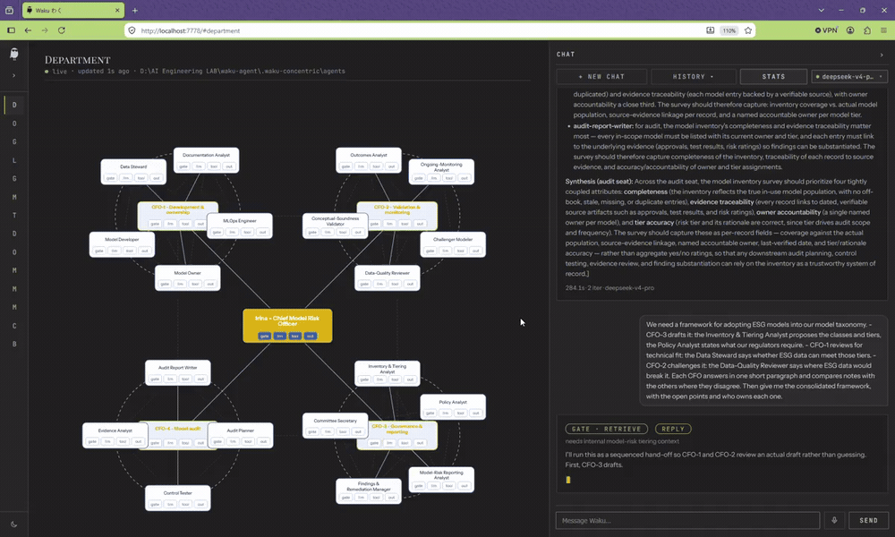

<picture>
  <source media="(prefers-color-scheme: dark)" srcset="docs/brand/irina-mark-on-dark.svg">
  
</picture>

# Irina Graph

> **Irina is under constant development.** The department runs end to end — delegation, scope and
> depth are enforced in code — but the prompts in this README are tuned for demonstration. For
> real use cases, expect to tune both sides: the role mandates in `concentric/roster.py` (a seat's
> mandate is what it thinks it may do) and how you phrase the task. A vague ask gets a vague
> delegation.

**A department of AI agents for model risk management, in code you can read.**

Irina is built on **[waku-agent](https://github.com/ShenSeanChen/waku-agent)** — a local-first
personal assistant that shows the four pillars behind every serious agent:
**Harness · Loop · Memory · Eval/LLM-Ops**, with no framework hiding the good parts.

This fork adds **`concentric/`**: a 24-seat department — one chief model risk officer, four
CFOs and nineteen workers — assembled from waku's own building blocks. Each seat is a full waku
agent with its own memory, prompt and tool registry, and the graph's rules are enforced in code
rather than in prompts.

- **The graph is code.** Scope is the delegation tool's role enum, depth is a ring counter, and
  a worker is given no delegation tool at all — the forbidden edges are absent, not refused.
- **Local-first.** Every seat keeps its own SQLite file. Open it. Read it. It's yours.
- **Watch it think.** A local dashboard draws the department and beats each seat as it works.
- **Eval built in.** Deterministic tests *and* LLM-as-judge, side by side, with a release gate.

**[Waku Memory](https://www.waku.one)** — the same memory in Claude Code, Codex, Grok Bot and this agent: [waku.one](https://www.waku.one) · [docs](https://www.waku.one/docs)

## The department

[](docs/department-demo.mp4)

*The GIF is a 20-second preview; click it for the full demo (7 min).*

```bash
uv run python -m concentric                  # talk to Irina in the terminal
uv run python -m concentric "tier the IFRS 9 model"
uv run python -m concentric.dashboard        # the department in the browser → localhost:7778
uv run python -m concentric.demo             # offline proof, no API key, no spend
```

Every seat runs on DeepSeek by default. Put `DEEPSEEK_API_KEY` in `.env`. The design is in
[Implementation/PLAN-waku-blocks.md](Implementation/PLAN-waku-blocks.md), and `waku/` itself is
unchanged — the department only adds to it.

### Try this

Paste it at the `you >` prompt, or into the chat dock on the dashboard:

```
Have CFO-1, CFO-2 and CFO-3 look at the IFRS 9 data together. The Data Steward
says where the data comes from, the Data-Quality Reviewer says what is unfit, and
the Policy Analyst says what the ECB requires of us. Have the three CFOs compare
notes with each other and come back with one plan.
```

Irina delegates to three CFOs; each one tasks the named worker in its team; the CFOs consult each
other where their answers overlap; and the answer comes back up as a single plan. In the
dashboard you can watch it: the spokes light as each seat is tasked, and the faint chords between
CFOs turn solid when they compare notes.

## Quickstart

Irina lives in this repository, not on PyPI. `pip install waku-agent` gives you **Waku** — the
agent runtime underneath — without the department, because the wheel ships only `waku/`. So
clone it:

```bash
git clone https://github.com/rderakhshan/Irina-Graph && cd Irina-Graph
uv venv && uv pip install -e .          # create the env; installs waku and the department
cp .env.example .env                    # add DEEPSEEK_API_KEY
uv run python -m concentric             # talk to Irina in the terminal
uv run python -m concentric.dashboard   # the department in the browser → localhost:7778
uv run python -m concentric.demo        # offline proof, no key, no spend
```

Every seat runs on **DeepSeek** by default. That default is one line in
`concentric/__init__.py`, and changing it there changes the whole department.

### Laminar — traces and evals (optional, needs Docker)

Irina writes one trace per run to a local [Laminar](https://github.com/lmnr-ai/lmnr)
instance: the trajectory, every seat it used, every hand-off, every model call,
and the per-run scores. Nothing else in Irina needs it — skip this whole section
and the department still runs. It is **on by default** once configured;
`IRINA_LAMINAR=off` turns it off, and a run is indexed locally either way.

**1. Run Laminar locally.** Five containers — frontend, app-server, Postgres,
ClickHouse, Quickwit:

```bash
git clone https://github.com/lmnr-ai/lmnr && cd lmnr
docker compose up -d          # the UI lands at http://localhost:5667
```

**2. Serve it under `/laminar`.** Irina embeds the UI in a rail page, and
Laminar refuses to be framed (`X-Frame-Options: DENY`), so the launcher proxies
it and strips exactly those headers. Next bakes its asset paths in at build
time, so the frontend has to be built with a base path:

```bash
docker build --build-arg NEXT_PUBLIC_BASE_PATH=/laminar \
  -t irina-laminar-frontend:latest ./frontend

cat > docker-compose.irina.yml <<'YAML'
services:
  frontend:
    image: irina-laminar-frontend:latest
    pull_policy: never
YAML

docker compose -f docker-compose.yml -f docker-compose.irina.yml up -d
```

(The published `ghcr.io/lmnr-ai/frontend-ee-basepath` image is the same idea, but
it is the EE build and its ClickHouse migrations disagree with an OSS database,
so it exits on startup. Building the OSS frontend keeps one schema.)

**3. Create a project, then give Irina its key.**

- Open <http://localhost:5667/laminar> and sign in with any email — self-hosted
  Laminar lets anyone in by default.
- Create a project, then copy the API key from **Project settings**.
- Put it in `.env`:

```bash
LMNR_PROJECT_API_KEY=<the key you copied>
LMNR_BASE_URL=http://localhost
LMNR_HTTP_PORT=8000
LMNR_GRPC_PORT=8001
```

That is the whole setup. From then on every run is traced, and each conversation
becomes one Laminar **session** — `session.session_id`, the same id the chat log
already groups by.

**4. Where to look.**

- **Traces** — one per run: `trajectory.irina` → `seat.<role>` → hand-offs →
  model calls, with tokens and cost.
- **The rail page** — **LLMOps → Observability and Evaluation Lab** embeds the
  UI inside Irina's dashboard, in Irina's own theme and type.
- **Sessions** — every trajectory of one conversation, together.

**5. Scores.** Laminar's evals are dataset → executor → evaluators, and here the
executor is the real department:

```bash
uv run python -m concentric.laminar_evals            # every datapoint
uv run python -m concentric.laminar_evals --limit 1  # one, as a smoke test
```

Each datapoint is one real department turn, so it costs what a turn costs.

Full detail, including what it does and does not record: [docs/laminar.md](docs/laminar.md).

### Waku is still here, and still works

Irina is twenty-four Waku agents, so the runtime underneath is yours to drive directly, exactly
as Waku documents it:

```bash
uv run waku                             # the single Waku agent, in the terminal
uv run waku dashboard                   # Waku's own cockpit → localhost:7777
```

Irina's dashboard **is** that cockpit — the same panels, the same `state.db` shape — pointed at
her, with a **Home** page in front of it, a **Department** view inside it, and an **Observation
Lab** that reads the traces and the state back as behaviour: how work moves, where the money goes,
how it fails, and what the ecosystem remembers. The rail keeps itself short: the cockpit's pages
fold under **LLMOps**, and the setup pages under **Setup**. `localhost:7777` is Waku;
`localhost:7778` is Irina. Comparing the two is the quickest way to see what this repository adds.

**Waku's own walkthrough.** *"Remember that Alex prefers morning meetings."* Quit. Restart.
*"Book a catch-up with Alex on Friday."* → it remembers, and books 9am. Waku's memory is one
file, `.waku/state.db`. Irina's is one file per seat, under `.waku-concentric/agents/`.

**Use the model you already pay for.** Anthropic (Waku's default), OpenAI, Gemini, DeepSeek,
MiniMax, Kimi, GLM, OpenRouter (one key, hundreds of hosted models), OpenCode Zen, or OpenCode
Go — set `WAKU_PROVIDER=`, paste the key, done. One dialect in the loop;
a [~60-line adapter](waku/loop/models.py) handles the rest.

New to it? **[Getting started](docs/getting-started.md)** walks Waku's whole setup, with a
check at the end of every step — and everything in it applies here, because the runtime is the
same one.

## Connect Waku Memory

Waku's own memory is local. **[Waku Memory](https://www.waku.one)** is the hosted memory you
share across agents: save something in Claude Code, recall it here.

```bash
pip install 'waku-agent[mcp]'           # in a checkout: uv pip install -e '.[mcp]'
waku connect waku-memory                # or /connect waku-memory in the dashboard chat
waku skill export --to claude,codex     # carry Waku's skills to Claude Code and Codex too
```

Your browser opens once to sign in. To connect Claude Code, Codex, Hermes or Grok Bot to the
same memory, see [integrations](docs/integrations.md#share-one-memory-with-your-other-agents-waku-memory).

## What's inside

| Pillar | In one line | Read more |
|---|---|---|
| **Harness** | gateways (terminal, dashboard, voice, Telegram, Discord, WhatsApp) and tools around one loop | [architecture](docs/architecture.md) |
| **Loop** | ~95 lines of plain Python: reason, act, repeat, with two ways to stop | [the tour](docs/tour.md#the-loop) |
| **Memory** | semantic, episodic and procedural (skills); a gate decides *whether* to remember, consolidation decides *what* to keep | [the tour](docs/tour.md#the-retrieval-gate) |
| **Eval / LLM-Ops** | deterministic tests and LLM-as-judge side by side, a release gate, a trace for every turn | [evals](docs/evals.md) |

**How is this different from ChatGPT or Claude Desktop?** Those are products you *use*. This is a
codebase you *own*: the loop, the memory schema, the gate and the eval harness are all yours to
read and change. Versus the big open-source assistants (OpenClaw, Hermes)? Same architecture,
1/100th the code.

## Docs

| Read | For |
|---|---|
| [Getting started](docs/getting-started.md) | installing, the first run, connecting Waku Memory |
| [The tour](docs/tour.md) | the dashboard, things to try, the loop, graph workflows, skills |
| [Architecture](docs/architecture.md) | every box on the whiteboard, and the file behind it |
| [Integrations](docs/integrations.md) | voice, Telegram, calendars, MCP servers, Waku Memory |
| [Commands](docs/commands.md) | every `waku` and `make` command |
| [Evals & tracing](docs/evals.md) | the two kinds of eval, the release gate, traces and spend |
| [Further evaluation metrics](docs/llm-agent-evaluation-taxonomy.md) | how the field measures LLM agents: the dimensions, the formulas behind each metric family, the benchmarks |
| [Roadmap](docs/roadmap.md) | what is live, what is still a skeleton, upgrade paths |
| [Whiteboards](docs/README.md#whiteboards) | the editable system-design charts |
| [lab/](lab/README.md) | Waku meets other agents and models: the experiments |
| [AGENTS.md](AGENTS.md) · [CONTRIBUTING.md](CONTRIBUTING.md) | the rules, and how to send a PR |

Code is MIT — see [LICENSE](LICENSE). The Waku name, mark and design system belong to
AutoManus Technologies, Inc. and are not MIT — see [LICENSE-BRAND](LICENSE-BRAND). Built by
[@ShenSeanChen](https://github.com/ShenSeanChen).
